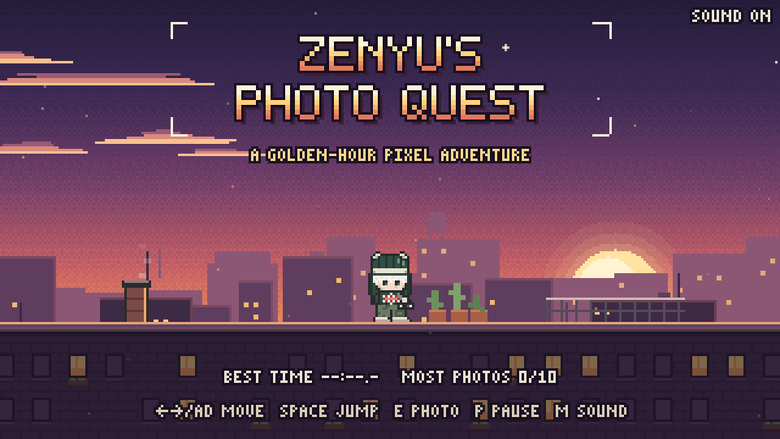
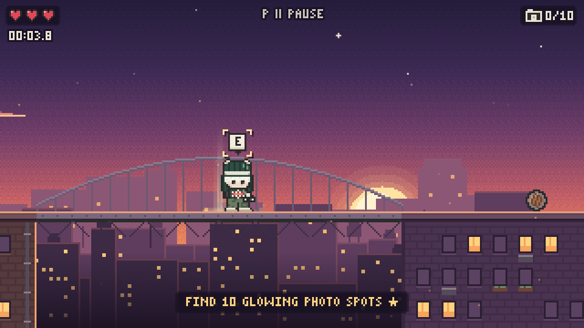
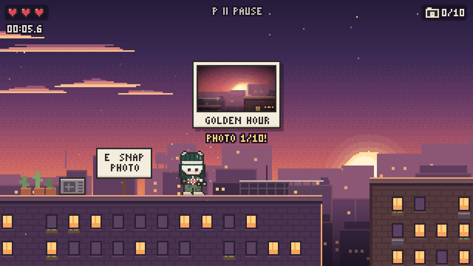
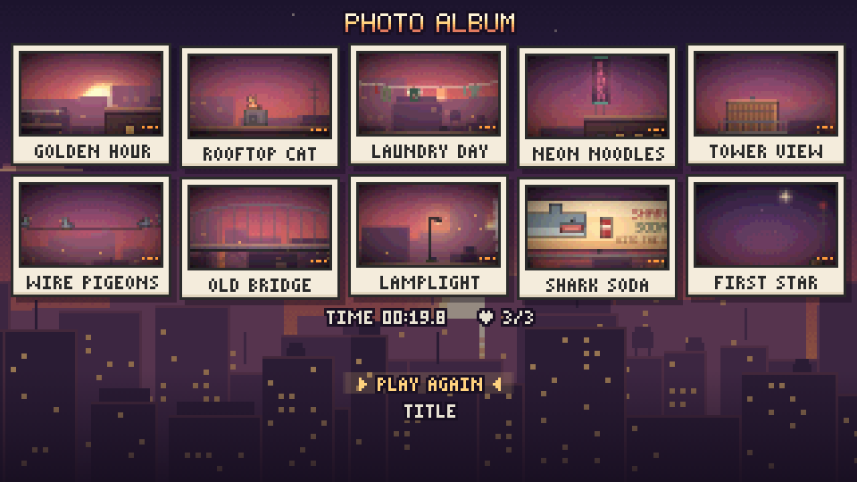

# 📷 Zenyu's Photo Quest

A tiny pixel-art platformer set on a city's rooftops at golden hour. Help **Zenyu**, a calm chibi photographer in a green bear-ear beanie and a shark-mouth jacket, find **10 glowing photo spots** while dodging pigeons, rolling barrels, steam vents and the gaps between roofs.

Every photo is real: when you press the shutter, the game re-renders the scene off-screen, frames the subject, and develops it into a little polaroid for your album.



| Crossing the old bridge | Snap! | The finished album |
| --- | --- | --- |
|  |  |  |

Built with **vanilla JavaScript (ES modules) + HTML5 Canvas**: no frameworks, no build step, no runtime dependencies, no image or audio files.

---

## Controls

| Action     | Keyboard                    | Touch (auto-shown on phones/tablets) |
| ---------- | --------------------------- | ------------------------------------ |
| Move       | `←` `→` or `A` `D`          | ◀ ▶ (slide your thumb between them)  |
| Jump       | `Space`, `W` or `↑`         | ▲ (hold longer to jump higher)       |
| Take photo | `E` or `Enter`              | 📷                                   |
| Pause      | `P` or `Esc`                | II                                   |
| Mute       | `M` (remembered)            | (use the device volume)              |
| Menus      | arrows + `Enter` / `Space`  | tap an option                        |

**How to play:** stand in a golden light beam and snap a photo. Collect all 10 to finish the album. Touching a hazard or falling between roofs costs one of your 3 hearts. Your best time and most photos are saved in the browser.

---

## Run it locally

Browsers block ES modules on `file://`, so serve the folder with any static server:

```bash
npx http-server -p 8080 -c-1 .     # or: npm run serve
# or
python3 -m http.server 8080
```

Then open <http://localhost:8080>.

## Tests & checks

```bash
npm install             # dev-only: installs Playwright (optional, for the smoke test)
npm run check:level     # plain Node, ~1s: proves all 10 photo spots are reachable
npm run serve           # in one terminal…
npm run test:smoke      # …in another: headless Chromium plays through the game
```

- **`tools/check-level.mjs`** uses the game's real `Player` physics to simulate about 40,000 jumps from every surface. It checks that every photo spot can be reached from the start, and that you can't get stuck somewhere with spots left behind.
- **`tools/smoke-test.mjs`** loads the game and fails on any JavaScript error. It walks and jumps, takes photos, gets hit by a pigeon, falls into a gap, pauses and mutes, collects all 10 photos to reach the album, loses to reach game over, tests touch controls on an emulated phone, and checks crisp scaling inside a small embed. It saves screenshots to `tools/screenshots/`.
- Dev pages: `/tools/sprite-preview.html` shows every Zenyu frame, and `/tools/level-preview.html?boxes` renders the whole level as one long strip with its collision boxes.

---

## Replace the sprite

Zenyu is drawn **procedurally** from pixel grids in `src/sprites.js` by default. To use your own art, drop a sprite sheet at **`assets/zenyu.png`**:

- 24×32 frames facing **right**, one animation per row: `idle` (2 frames), `walk` (4), `jump` (1), `photo` (2).
- The layout (frame size, rows, frame counts, fps and foot anchor) lives in `SPRITE_SHEET` in **`src/config.js`**. Change it to match your sheet.
- Optional rows such as `fall` and `hurt` can be added there. Missing ones fall back to `jump` and `idle`.

On load, the console tells you which mode is active:

```
[Zenyu] Sprite sheet loaded from …/assets/zenyu.png — using sheet mode.
[Zenyu] No assets/zenyu.png found (that is fine!) — drawing Zenyu procedurally from pixel grids.
```

If the file is missing, broken or too small for the configured layout, the game quietly falls back to the procedural Zenyu and never crashes. Probing for a missing file does log one browser `404` network line; that is expected. See [`assets/README.md`](assets/README.md) for details. [`docs/reference/zenyu-character-sheet.png`](docs/reference/zenyu-character-sheet.png) is the original character reference sheet the pixel art is drawn from. It is not a sprite sheet.

---

## Embed it in a portfolio

The game mounts into **any element that has a size**, and injects its own scoped styles:

```html
<div id="zenyu" style="aspect-ratio: 16 / 9"></div>
<script type="module">
  import { init } from './zenyu-photo-quest/src/main.js';

  const game = init(document.getElementById('zenyu'), {
    autofocus: false, // focus the game immediately?
    // spriteUrl: '/assets/my-zenyu.png', // optional sprite sheet override
  });
  // game.pause();   // e.g. when a modal opens
  // game.destroy(); // e.g. when a SPA route unmounts
</script>
```

- The keyboard is only captured while the game has focus (click it or Tab to it), so arrow keys still scroll your page.
- The game pauses itself when it loses focus or the tab is hidden.
- See [`examples/embed.html`](examples/embed.html) for a portfolio-card example.

---

## Deploy

It is a static site with `index.html` at the root, and every path is relative, so it works from a sub-path like `/<repo>/`.

**GitHub Pages**
1. Push to `main`.
2. Go to **Settings → Pages → Build and deployment → Deploy from a branch**, then choose `main` and `/ (root)`.
3. The site appears at `https://<user>.github.io/<repo>/`. The included `.nojekyll` skips Jekyll processing.

**Vercel**
1. **Add New → Project**, then import the repo.
2. Framework preset: **Other**. Leave the build command empty and set the output directory to `.` (the root).
3. Deploy. From the CLI you can instead run `npx vercel` in the repo root.

(`package.json` only holds dev scripts and has no build step. Playwright has no install hook, so Vercel's install stays light.)

---

## Project structure

```
index.html            page shell → init(#game)
styles.css            page-level styles (the component injects its own)
src/
  main.js             init(), fixed-timestep loop, state machine, transitions
  config.js           palettes + every tunable number (physics, hazards, photo, sprite sheet)
  display.js          DOM + integer device-pixel scaling + letterboxing
  input.js            keyboard (focus-scoped), touch buttons, taps → actions
  player.js           Zenyu: movement, coyote time, jump buffer, squash & stretch
  collision.js        AABB + one-way platforms (commented)
  camera.js           look-ahead follow camera + screen shake
  level.js            hand-placed rooftop city as pure data
  play.js             one run: spots, photo sequence, hazards, hearts, win/lose
  entities.js         pigeons, barrels, steam vents, particles, floating text
  photo.js            real off-screen photo capture + polaroids
  render.js           world rendering, spot beacons, viewfinder, flash
  hud.js              hearts, counter, timer, flying polaroid
  ui.js               title / pause / game over / album screens, menus
  background.js       dithered dusk sky, sun, clouds, 3 parallax skylines
  art.js              rooftop facades, props, creatures
  sprites.js          zenyu.png loader + procedural pixel-grid fallback
  font.js             hand-made 3×5 and 5×7 bitmap fonts
  audio.js            Web Audio synth SFX + ambient loop
  storage.js          safe localStorage (best time, most photos, mute)
  pixelgrid.js        pixel-grid helpers + seeded RNG
assets/               optional zenyu.png lives here
tools/                level check, smoke test, sprite + level previews
examples/embed.html   embedding example
```

---

## Tech decisions

- **Vanilla JS + Canvas, zero dependencies.** It loads instantly, deploys anywhere static, and is easy to read in a portfolio. Small modules and classes, with no global state.
- **Native 320×180, integer-scaled in *device* pixels.** The canvas is scaled by the largest whole number that fits (after accounting for `devicePixelRatio`) and letterboxed, so pixels stay perfectly square on any screen. `imageSmoothingEnabled = false` and `image-rendering: pixelated` keep it crisp.
- **Fixed timestep (1/60 s) with interpolation.** Physics is identical at 30, 60 or 144 Hz. Leftover frame time interpolates positions so high-refresh displays stay smooth, and input presses are latched per simulation step.
- **Everything is procedural.** Zenyu, the city, the fonts and the audio are generated in code from pixel grids, seeded RNG and Web Audio oscillators and noise. There are no binary assets to manage, and the brand palette lives in one place (`PALETTE` in `config.js`).
- **Photos are real captures.** The world renderer can draw any frame to an off-screen canvas without Zenyu or UI. `photo.js` crops the subject, box-downsamples it 2×, and adds a warm film tone and vignette. The album is made of what you actually photographed, pigeon photobombs included.
- **The level is data, and it is verified.** `level.js` has no DOM access, so a Node script can run the real physics against it and prove every photo spot is reachable.
- **Forgiving controls.** Coyote time, jump buffering, variable jump height, a buffered photo button, a hurtbox slightly smaller than the sprite, and respawning at the last safe ledge.
- **Accessibility basics.** Focus-scoped keyboard input with a visible focus ring. `prefers-reduced-motion` reduces screen shake, softens the flash and replaces the shutter transition with a fade. The pause controls are always on screen, an `aria-live` region announces photos and the win, and auto-pause kicks in on blur.

### Decisions made where the brief was open

- **Palette.** The seven brand colours are used exactly. The pixel art also needed a skin tone, a darker knit/jacket shade, a camo shadow, a mouth pink and a lens grey. These live in `PALETTE_EXTRA`.
- **Font.** A hand-made bitmap font instead of Google Fonts keeps the game at zero external requests.
- **Camera and world height.** The world is exactly one screen tall, so the camera only scrolls horizontally. That keeps the dusk sky composed in every shot.
- **Photos.** They can be taken in any order. Pressing the shutter away from a spot does a "dry" click with a hint and doesn't count. The world freezes briefly for each real shot, but the run timer keeps ticking so times stay honest.
- **Hazards.** Pigeons are dodged, not stomped (Zenyu is a photographer, not a plumber). Falling between roofs costs a heart and respawns you on the last safe ground.
- **Sound.** The mute setting is remembered. Music ducks while paused, and all audio is suspended when the tab is hidden.

## Known limitations and ideas

- There is one hand-made level. A second district (a night market? a harbour?) would reuse every system.
- There is no gamepad support yet. The input abstraction would make it a small addition.
- The procedural Zenyu has 7 animations. A hand-drawn sheet could add turn-around or idle-fidget frames.
- The album could offer "download photo" or share buttons, since the thumbnails are already canvases.
- Audio is synthesised, so it sounds charming but chiptune-simple. A composed loop could be dropped in through `audio.js`.

---

Character design: Zenyu ([reference sheet](docs/reference/zenyu-character-sheet.png)). Code, pixel art, fonts and sounds are all generated in this repo.
